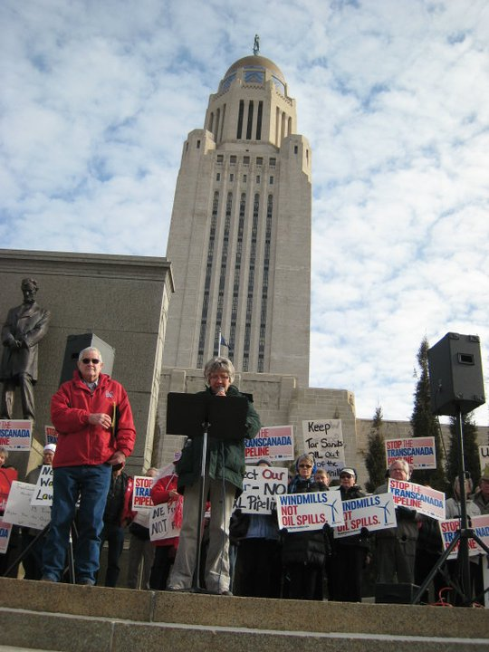

% Power, Discourse, and Deinstitutionalization
% Julian Barg & Mark J. Zbaracki
% July 8, 2022

::: notes

\* "Big oil" or "big business"--what does that actually mean? What happens there on the ground?

:::

<!-- # Say you had to build a pipeline

# ...

 -->

# Discourse

## Deinstitutionalization

* Discourse and deinstitutionalization [see also @Maguire2009; @Suddaby2017; @Ferns2021]
	1. Taken-for-grantedness--stable institution
	2. Problematization--actors raise issues to disrupt
	3. Translation--audience disseminate, adopt problematizations into their own practices and projects
	4. Deinstitutionalization--institution no longer taken for granted
* Translation
	- A social process--not cognitive
* Institutional defense
	- The process of preempting problematization, translation
	- But how do institutional insiders or fields preempt a social process that others are engaged in?

# Discourse

## Framing

* Borrowing from framing literature to study discourse as a social process
* Three different takes on frames to highlight our approach:
	1. :x: Cognitive--using heuristics to make sense of the world and respond accordingly [@Hahn2014]
	2. :x: Strategic--what frames lead to desired outcomes [@Briscoe2016]?
	3. :heavy_check_mark: **Interactional**--how are frames developed within a social system [@Reinecke2021]?

# Context--climate change

:::::::::::::: {.columns}
::: {.column width="50%"}

:::
::: {.column width="50%"}
	
* Scientists are turning activist
* Typically view world through natural framework [@Goffman1974]
	- Measuring concentration of particles in atmosphere
	- Observing warming from satellites
	- Largely bypass social systems when studying climate change

:::
:::::::::::::

# Context--Keystone XL (KXL)

:::::::::::::: {.columns}
::: {.column width="50%"}

:::
::: {.column width="50%"}

* 1,897 km pipeline to transport oil sands from Canada to the US
	- Crosses three states, triggering permitting processes, academic discourse, local and federal legislative initiatives
* On the signs: subject positions, rooted in specific social system

**Literature focused on natural, not this social framework**

:::
:::::::::::::

::: notes

\#\# Some of the signs

\* Do You Want Oil on Your Corn

\* a little bird told me... "Our elected leaders can protect our homes and waters." Stop the TransCanada Pipeline. SaveTheSandhills.org

\* Canada--Keep Your Pollution (foreshadowing)

\* Trust BP Shame On Them. Trust TCP Shame on NE [Nebraska]

\* TransCanada Can Use Eminent Domain? No Way

\* Protect Nebraska's Economy

\* Unicam Protect Our H2O. Take a Damn Stand

\* Our Water, Our Future

\* Future Huskers [Cornhuskers] Need Clean Water

\* Nebraska is 3rd In Wind Energy Potential! Help Our State Develop Its Full Potential!

:::

# Methods

"The fossil-fuel industry's aura of invincibility is gone. They've got all the money on the planet, but they no longer have unencumbered political power."

--Bill McKibben in The Guardian [-@McKibben2015]

* Keystone XL as celebrated victory for environmentalists--how did it *really* go down?
* Approach--where is the action? What does this turn on?
	- Enter into key battleground--Nebraska
	- Pick up five issues that were raised
		+ One successful, four without success
	- Four dynamics
		+ We show the dynamics operating on successful and unsuccessful issues

# Methods, issues & dynamics

1. Climate change
	* Oil sand climate emissions between 30-300% higher than other fossil fuels
	* Dynamic: dismissal
2. Spill risk
	* KXL could spill crude oil into the Ogallala aquifer--source of drinking water for 30% of Americans, 85% of Nebraskans
	* Dynamic: rules of the game
3. Benzene in oil sands
	* Oil sands are a health concerns because they are diluted with lighter petroleum products, including the toxic benzene
	* Dynamic: information dearth
4. Jobs
	* Cornell University study contests number of jobs to be created--2,500 rather than 20,000 or even 120,000 jobs?
	* Dynamic: counter coalition
5. **Eminent domain**
	* Although KXL has no federal or state permit, TransCanada uses eminent domain to "bully" Nebraska landowners, acquire easements

::: notes

We will go through five issues and I will show you four dynamics that are playing out in an interactive fashion. For expedition, I will use each issue to demonstrate how one dynamic plays out. And also show that for eminent domain.

\#\# Some of the signs

\* Trust BP Shame On Them. Trust TCP Shame on NE [Nebraska]

\* TransCanada Can Use Eminent Domain? No Way

\* Protect Nebraska's Economy

\* a little bird told me... "Our elected leaders can protect our homes and waters." Stop the TransCanada Pipeline. SaveTheSandhills.org

\* Unicam Protect Our H2O. Take a Damn Stand

\* Canada--Keep Your Pollution

\* Our Water, Our Future

\* Do You Want Oil on Your Corn

\* Future Huskers [Cornhuskers] Need Clean Water

\* Nebraska is 3rd In Wind Energy Potential! Help Our State Develop Its Full Potential!

:::

# Climate change--example of dismissal

:::::::::::::: {.columns}
::: {.column width="50%"}

## Climate change (forestalled)

*Sen. Carlson*: Are you--do you believe in global warming? (Laughter)

*Tim Taylor (landowner)*: I'm--honestly, I'm not sure. I'm not trying to be cute or...I'm not sure.

*Sen. Carlson*: I'm asking you these--I think your reservations and your resistance [against KXL] is for pure reasons. And I appreciate that. Thank you.

:::
::: {.column width="50%"}

## Eminent domain (disrupted)

*Sen. Adams*: With the number of constituents that I have that feel as though, right or wrong, that they have in effect been pushed to the edge and said, sign the easement agreement or we're going to court, all right, that is how eminent domain works. But you haven't been permitted yet. I struggle with that.

*Sen. Carlson*: Time.

:::
:::::::::::::

::: notes

\* Going in climate change, explaining how dismissal works, and showing that that also happens for eminent domain.

\* On the left--Nebraska Legislature floor debate. 

\* The Nebraska legislature has time limits for speaking during floor debates. If a senator runs out of time, then they are disrupted like on the left. Discourse stalled or prematurely ended etc.

\* Eminent domain was "kept alive" as an issue by a variety of actors who raised the issue again and again.

\* On the right--public hearings--rules more relaxed.

\* On the right, imagine how the conversation could have gone if Taylor had responded differently. We don't really have to imagine, because there are conversation with environmentalists. Also, imagine the effect of this exchange if you were the next person to testify, or testify later that day.

\* \*\*Just because somebody says something does not mean it will get heard!\*\* The senators can just move on to the next witnesses testimony and pretend the words were never uttered.

<!-- Need to explain the social component of dismissal.

1. Dismissal takes place before dialogue even begins.
2. In our context, many stakeholders are not even heard but skipped over--but it is difficult to demonstrate the *absence* of communication.
3. On the right here, Tim Taylor is *not* dismissed because he takes a position that Senator Carlson finds "pure". But their exchange signals to subsequent participants that climate change is not a welcome issue. -->

:::

# Pipeline spill risk--example of rules of the game

:::::::::::::: {.columns}
::: {.column width="50%"}

## Pipeline spill risk (informal rules, excerpt)

Sen. Haar: So, you know, the question will come up so I'll just ask it. Well, how does the fact that you're with NRDC color your testimony here today?

Anthony Swift: Well, my testimony has been fact based. [...]

Sen. Haar: So I get, you know, just extending that further, I mean, what...so what business do you have in Nebraska?

:::
::: {.column width="50%"}

## Eminent domain (informal roles)

(During Alan Peterson testimony on legal issues related to pipeline siting law)

Sen. Christensen: Okay. What is Sierra Club's stance on fossil fuels versus renewables?

Alan Peterson: I don’t know.

Audience: Oh, oh, oh. (Laughter)

Sen. Christensen: I'm done.

:::
:::::::::::::

::: notes

\# Just include one sentence of what Swift says.

\* On the left, excerpt of longer, 2,500 word "interrogation" Anthony Swift who came from Washington and was not warmly welcome. Lawyer at NRDC who had studied Kalamazoo River oil spill, one of the largest inland spills in US history, which involved oil sands like the one KXL would carry. 

\* Important--Swift lots of expertise, but did not get to talk about that--conversation was sidetracked by the legitimacy of his being there. Rather informal rule, but deprived him of opportunity to speak about subject matter. Trial and execution in one go, complete character assassination.

\* On the right--similar attack happened elsewhere, but Peterson managed to steer conversation back--Peterson is familiar to the senators for directing lawsuit in favor of nuclear waste dump against Nebraska! $150 million legal bill for Nebraska! So his (non)stance on renewables is credible--very contingent!

<!-- Need to explain function of rules of the game--it is dynamics and conversations that takes place *instead* of the discourse about the issue.

1. Changing the topic--not talking about or refusing to talk about the issue at hand. -->

:::

# Benzene in DilBit--information dearth

:::::::::::::: {.columns}
::: {.column width="50%"}

## On benzene in DilBit

Sen. Haar: Now TransCanada really sort of pooh-poohed the idea of benzene, that benzene could enter groundwater. Is benzene a problem in groundwater or?

Dr. Woldt: Well, I don’t know what the constituents are in the fluid that TransCanada is talking about pumping, so I don’t know if benzene is in there if that would be a problem or not.

:::
::: {.column width="50%"}

## On eminent domain

Sen. Haar: Since you're a landowner and the pipeline is slated to go through there, as I stated earlier, part of LB1 is that the Public Service Commission would take into account how landowners are treated. And when TransCanada said, "We also treat our 60,000 landowners with respect and fairness," how would you react to that?

Connie Weichman: Probably that we weren't treated fairly. But we have signed a nondisclosure statement, and so I don't really feel I can elaborate too much.

:::
:::::::::::::

::: notes

\* Information dearth--institutional insiders often control access to data!

\* I will do violence to these examples by shortening them a lot, more nuance and detail.

\* On the right: conversation with Dr. Woldt of UNL. UNL faculty were invited to testify and asked to collect information. Treated better than Corlell University staff from next slide. Woldt tried to collect more information, but could not access information on composition. Stalled for one year. 

\* "[W]e want to base our decisions on sound science so we have studies that are being done. But [...] they're always incomplete or there's always more to learn. And one of the drawbacks as I see it to maybe having that kind of philosophy is that we want sound science, and we want the university and other institutions to study things that are of interest to us... They'll study them forever for you."

\* TC countered by claiming that information is available.

\* On the right: TC consistently uses nondisclosure agreement. Also lie to landowners and "bully" them (their own words). Makes it difficult for landowners to compare and organize, know what's normal. In many instances, sign easements out of fear. Landowners cannot give detailed information bc NDA. Overcome because they are organized and provide piecemeal information, stitched together. Also, Landowners for Fairness has experience from Keystone. Very contingent!

:::

# Jobs claims--counter coalitions

:::::::::::::: {.columns}
::: {.column width="50%"}

## On jobs problematizations

[W]e've had lengthy testimonies and contact and information provided to us by a number of the labor organizations in Nebraska that seem quite knowledgeable of what impact this pipeline is going to have on their union members in Nebraska. And I'm struggling here not...I mean, I welcome you to come and testify and I appreciate your testimony. But these are folks, these are jobs that are located in Nebraska that are talking about firsthand the impact this pipeline is going to have in Nebraska.

:::
::: {.column width="50%"}

## On eminent domain

Sen. Haar: [C]ould we in any sense be held responsible for the easements that are purchased before the permit in your opinion? 

Alan Peterson: TransCanada has 1,800 lawyers or so, as near as I can tell. They'll present [their case] very well I'm sure.

:::
:::::::::::::

::: notes

\#\# Counter coalitions are the final hurdle--even with legitimate problematization, might not change official subject position because of social context

\* Lara Skinner, PhD U of Iowa, working at Cornell. School of Industrial and Labor Relations. Cornell wrote report on jobs claims. Explaining why KXL 2,500 jobs, 50 permanent. Not 20,000 or even 120,000. Also, risk for aquifer which supplies agriculture--15% of Nebraska economy.

\* TC PLA for KXL with unions--union managers advertising KXL. Locally embedded. Lara Skinner coming from outside and facing suspicion of being "socialist". Data is not king, the coalition is.

\* On the right: Peterson convinces senators that they can take legislative action, but senators still hesitant, bc. TC would fight back. Even if you are right, you still have to convince the court, and resources are important for legal battles. TC sending two high-profile lawyers from NE to session. Peterson also respected, but senators decide to play it safe, make compromise with TC. Ironically, few months later compromise provides opening for anti-KXL coalition. Again, very contingent.

:::

# This is the last slide before the Q&A

* Epilogue: the story turns on eminent domain and three landowners who were "bullheaded" and would not settle for any price.
* Three points:
	- Interactional nature of framing processes
	- Highly contingent process--e.g., three landowners doing the final lawsuit
	- Reliability and validity

Thank you!

::: notes

\* The whole series of events is contingent, but this is the most profoundly contingent.

\* Last very contingent element in a series of contingent events

:::

# References