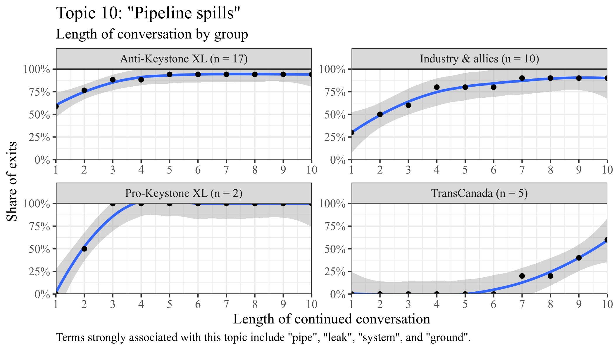
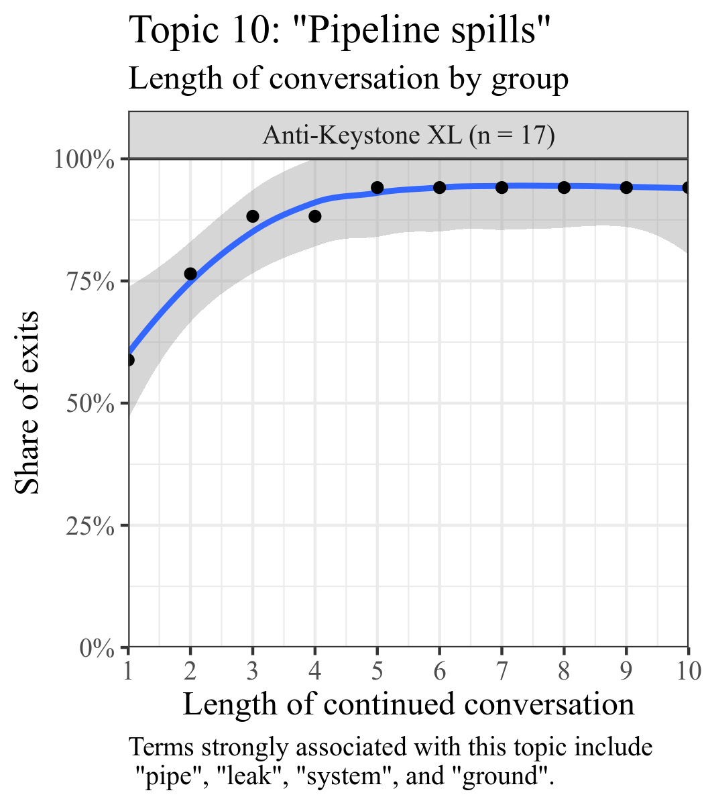
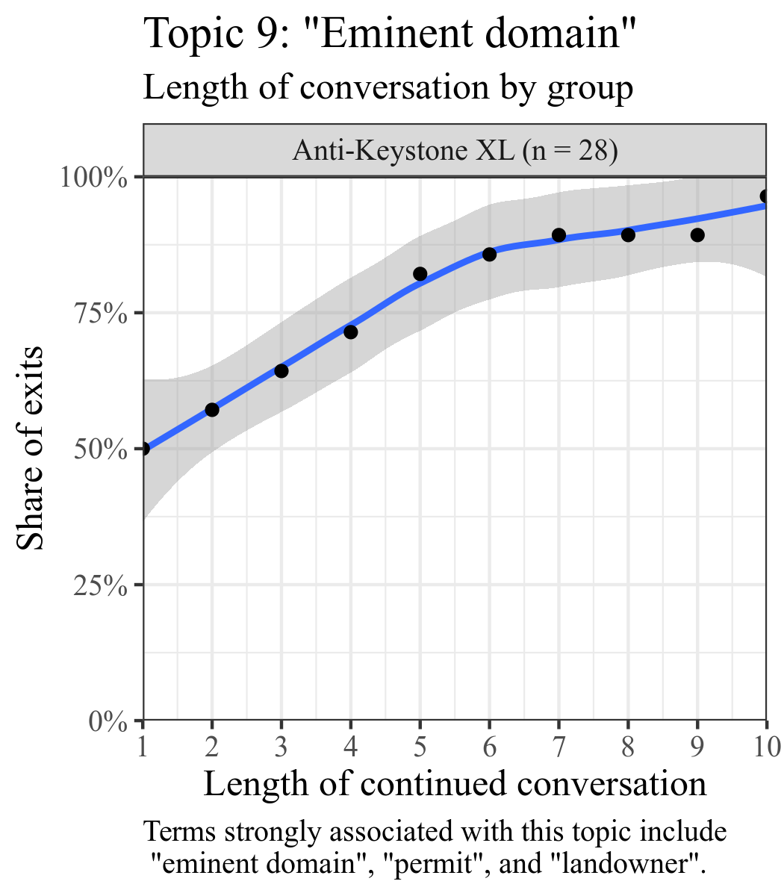
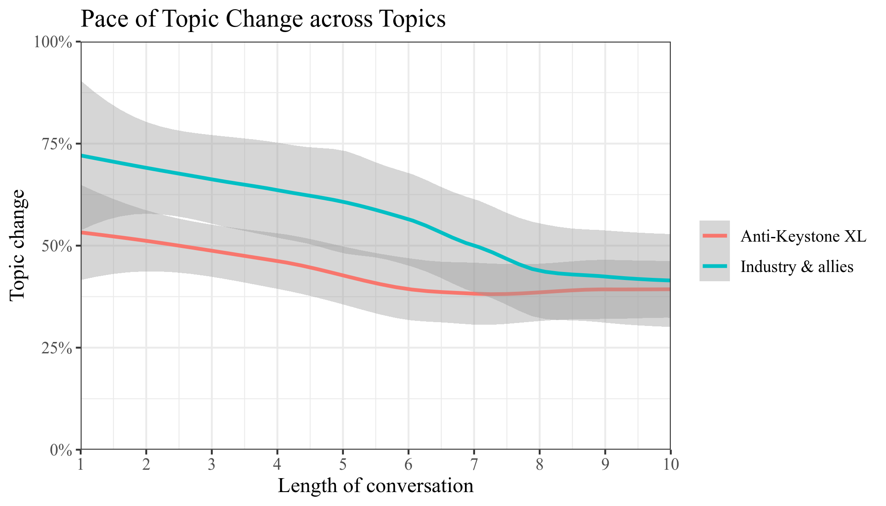

::: notes
* Thank Bodo
* Stage of the paper
  - Iteration of EGOS
  - Taking that feedback, and doing what we need to do for ASQ submission
  - Proto job talk
  - I am probably at a stage where I want to streamline 
* Skip talking about myself
:::

## Most recent

* Greenwashing in the Anthropocene: Net Zero by 2050
  - *Organization & Environment*
  - With Wren Montgomery (Ivey Business School) and Tom Lyon (Ross School of Business, University of Michigan)

::: notes
* Also SSHRC grant.
* Working on this through a SSHR grant--national grant of Canada--we still need to get to spending that money.
:::

---

* Please interrupt at any time (pretend it is not Zoom)

## Motivation

* Is there an indication that at some point we will stop expanding fossil fuel extraction?

::: notes
* Keystone XL--poster child for curtailing the oil and gas industry.
 - Celebrated as the biggest climate victory to date.
 - Does this victory indicate there may be more victories in the future?
* So we are testing discourse and activism under ideal conditions.
* Through what specific actions is the "institution" oil industry realized?
  - It is one thing to observe structurally the growth of oil production and to conclude that the industry has governments in the bag.
  - It is another thing to show that in practical terms.
  - Fortunately, here I met Mark Zbaracki, who is even more cynical than me ever since he studied the sinking of the Ferry Estonia.
:::

# A theoretical story--institutional processes & institutional change

## Macro model

**New ideas are translated into institutional change**

1. Taken-for-grantedness of the institution [e.g., @Zucker1977]
  - Institution is stable
2. Problematization of the institution [@Maguire2009; @Suddaby2017]
  - An actor raises an issue
3. Translation [@Lawrence2017; @Hardy2020]
  - Other actors act on the problematization
  - Changes to practice
4. Institutional change or deinstitutionalization [@Harmon2015]

::: notes
1. Note questioned.
2. Maybe in response to an endogenous or exogenous shock, something that provides more information.
3. Not the same people. Not the same motives. So in the translation process, the original ideas usually change, sometimes dramatically.
:::

## Critiques

* Model does not sufficiently consider structural constraints [@Barley2008]
  - All steps of an institutional process are interactive
    + Including step 2 & 1
  - Institutional process occur in specific arenas with their own rules
    + These arenas usually favor institutional insiders
  - Institutions consist of organizational fields [see also @Barley2007]
    + Includes loosely coupled organizations that hold institutionalized understanding
* Discourse analysis cannot [@Leibel2018]
  - \(1) neglect agency expressed in framing and rhetorics
  - \(2) neglect structural constraints put up by inhabitants of the institution

::: notes
* The two make related points, but in different context, @Leibel2018 is more focused on discourse.
  - Related because they both want to move from abstract institutions to concrete organizations and people.
  - Also, that one can really be "brutalized" by institutions, it is a very real experience, not abstract.
  - E.g., how Rachel Carson was treated--she is often used as the prime example of deinstitutionalization.
* Loosely coupled fields means we may encounter resistance in many different and vague ways.
* The last point challenges us to consider (1) who is a part of the institutional field"? (2) What do these inhabitants want and do?
:::

## Microfoundations of institutions

**Institutions are unlikely to be directly challenged**

* Stable institutions rest on implicitly held assumptions [@Harmon2019].
  - No explicit backing needed.
* When actors use a rhetoric that violates these assumption, this is *awkward* and leads to backlash [@Steele2021].
  - In my context, actors try to fit in and avoid this.
* Actors can also actively push back and restore institutions [e.g., @Lok2013; @Harmon2019].
  - E.g., reaffirming, positive speech, negotiation, reflection and normalization.
* Most impactful are the earliest moments of change, when an institution is initially foregrounded [@Smets2012].
  - These moments are where the action is.
* Actors can strategically borrow from other institutional fields to make an argument [@McPherson2013; @Harmon2015].

**Summary**: The action may be where people are *not* talking!

::: notes
* Well executed foregrounding can be like opening Pandora's box.
* If the action is not where people are talking, it is where something is so taken for granted that it need not be talked about.
  - "Suppression", sometimes obvious, sometimes implicit.
:::

## Example--Dismissal

**\#**| **Speaker**         | **Remark**  | **Topic(s)**
---   | ---                 | ---         | ---
278   | Mark Welsch         | *[...] I think it is very irresponsible [...] to think about spending a dime building electric transmission lines to service pumping stations that may not ever be built. If they are planned, the electric lines, and built, I hope that they will be built with the capacity to move power from all windfarms that will be built near those new power lines. Because we must stop global warming caused by burning fossil fuels, I believe this pipeline may become obsolete within 30 years. If we don't, the Pentagon has said they are concerned for our security in and out of this country due to global warming and the climate changes that it will cause. Some people think the third world war will be fought over water because of global warming and climate change. Thank you very much.*   | Climate change
279   | Senator Ashford     | *Thanks, Mark. Questions of Mark? Seeing none, thank you. Next proponent.*                                                                | Hearing process

::: notes
* Here is an individual who tries to engage in a debate about climate change. 
  - 2011, less refined rhetoric.
  - Note the response that he gets. There is discourse but no exchange or interaction.
* There is a lot of this in the data. Not just in this arena, Nebraska Legislature. Everywhere, e.g., state department.
* The action is no where all the interaction is, but with this!
:::

## Puzzles

* How do we show institutional processes if people are not talking?
* How to avoid sampling on dependent variable: institutional outcomes?

::: notes
* These two are closely related--the second one is just saying, we want to see how an institution prevents assumptions from being foregrounded.
* Second: We do not want to select on dependent variable! Do not go to the successful interaction, go to the process.
  - Where there is institutional change, by definition something has been successfully foregrounded and permanently challenged.
* Choose something that is not settled, where there is a controversy.
  - To see why it goes a certain direction and not another.
  - Have to know what is going on in the discourse--you need the discourse's context, interactions, where there is not anything happening.
  - Which can both be preventing change or leading up to change when inaction is broken.
:::

# Background

::: notes
* Question: can a random member of the audience tell me what she/he knows about Keystone XL?
:::

## Keystone XL pipeline

:::::::::::::: {.columns}
::: {.column}

:::
::: {.column}
**Proposed Keystone XL route**

* Direct route from Hardisty, Alberta to Steele City, Nebraska
* Transports oil sands diluted with natural gas condensate
  - Contains carcinogens such as benzene]
* Rallying point for climate movement
* Crossing Midwestern states
  - Low population density
  - In favor of Keystone
:::
::::::::::::::

## Keystone XL and Nebraska

:::::::::::::: {.columns}
::: {.column}

:::
::: {.column}
**Ogallala aquifer**

* Irrigation water for 30% of America
* Drinking water for 85% of Nebraska
:::
::::::::::::::

<!-- ## Arenas & institutional field

* Demonstrate arenas and organizations (translate notebook drawing into illustration) -->

## Timeline

**\#**| **Stylized story**          | **Shifting grounds**        | **Shifting arenas**
---   | ---                         | ---                         | --- 
1.    | Pipeline proposed (2008-)   | Anti-pipeline (2010)        | TransCanada & State Department (2008-2011)
2.    | Climate movement (2010-)    | Ogallala (2011)             | Nebraska grassroots & legislature (2011)
3.    | Industry curtailed (2015-)  | Eminent domain (2012-2015)  | Nebraska landowners & court (2012-2015)
4.    |                             | Climate change (2015)       | White House (2015-2021)

::: notes
* Goal is not a precise timeline, but to give you an idea how different perspectives draw attention to different events.
* Left to right--gradually moving away from the rather linear discourse model toward institutional processes and fields.
:::

## Matrix--Arenas
  
\-                        | **Grassroots**  | **Industry Orgs.**  | **Pro-KXL labor** | **Landowners**  | **National NGOs**   | **Nebraska Legislature**  | **Nebraska public**   | **State Department**  | **TransCanada**
---                       | ---             | ---                 | ---               | ---             | ---                 | ---                       | ---                   | ---                   | ---
**Grassroots**            |                 |                     |                   | **X**           | **X**               | **X**                     | **X**                 | **X**                 |
**Industry Orgs.**        |                 |                     | **X**             |                 |                     | **X**                     |                       |                       | **X**
**Pro-KXL labor**         |                 | **X**               |                   |                 |                     | **X**                     |                       | **x**                 | **X**
**Landowners**            | **X**           |                     |                   |                 |                     | **X**                     |                       | **x**                 |
**National NGOs**         | **X**           |                     |                   |                 |                     | **X**                     |                       | **X**                 |
**Nebraska Legislature**  | **X**           | **X**               | **X**             | **X**           | **x**               |                           | **X**                 | **x**                 | **X**
**Nebraska public**       | **X**           |                     |                   |                 |                     | **X**                     |                       | **x**                 |
**State Department**      | **X**           |                     | **x**             | **x**           | **X**               | **x**                     |                       |                       | **X**
**TransCanada**           |                 | **X**               | **X**             |                 |                     | **X**                     |                       | **X**                 |

## Mixed methods

* We create a timeline and inductively code the discourse
  - Nebraska repeatedly in the spotlight
* Inductive coding repeatedly inconsistent and unresolved
  - Universally declared intention to resolve environmental and social issues
    + Few actors except TransCanada directly object Keystone XL problematizations
  - Simultaneously often expressed or implicit support for pipeline
  - Actors effectively stalling the pipeline
  - Content of dialogue often tangential to the overarching discourse
* Conflict often around timelines and process not issues
* Both sides acknowledging that delay might kill pipeline

*Bottom line**: lack of definitive actions *suggests* support for fossil fuel, but inductive coding of discourse contents insufficient 

::: notes
* In fact, there are some quotes that point to a key role of time in potentially bringing Keystone XL down.
* We zoom in on one arena. Each arena has its own rules that need to be understood.
:::

## Data

* Qualitative
  - 16 public hearing transcripts
  - 52 letters
  - 6 internal meeting memos
  - 22 reports and bill drafts
  - 130 Newspaper articles and blog posts
* Quantitative--zooming in on one arena
  - Year of the tipping point 2011
  - 8 public hearings of the Nebraska Legislature
  - Additional 8 public hearings to create more accurate topic model
  - Open hearings
    + Anybody can come
    + Five minutes to talk
    + The Senators as gate keepers who create discursive space by asking questions
* Topic model
  - Mathematically
    + Parsing the words in a discourse and determining which terms often co-occur
  - Choice of parameters
    + 29 topics that can be used to organize documents. (Statements always have multiple topics)
    + There are indicators for fit, but ultimately need to vary parameter and inspect output
  - Inductive nature
    + We manually label the topics based on words and documents. (Not unlike traditional coding process.)

::: notes
* Gatekeeping function: that is why the initial quote is so important.
:::

## Qualitative--concepts

* Dismissal
  - A statement is recorded but never referred to again
  - Or the statement "absorbed" through ceremony
    + E.g., an noncommittal statement is added to an inconsequential report which nobody reads 
* Change of topic
  - In response to a statement about topic X, the conversation is steered to topic Y
  - In particular, outsiders are often questioned regarding their funding, credentials, and motives rather than expertise
* Information control
  - Institutional insiders and allies control information which experts would need to make definitive statements
  - E.g., regarding composition of oil sands or TransCanada's use of eminent domain
* Counter alliances
  - Institutional insiders present allies that make it difficult to determine ultimate authority
  - E.g., Cornell University labor institute vs. pro-pipeline labor unions

## Qualitative--Dismissal

*Dear Senator Johanns*

*Thank you for your letters regarding alternative routes for the TransCanada Keystone XL Pipeline. [...] We are carefully considering your concerns as part of our meticulous environmental review, consistent with the National Environmental Policy Act and Executive Order (E.O.) 13337.*

*[...] Since we have a strong commitment to the environment and to ensuring that decisions related to the pipeline are fully informed, your letters have been included in the administrative record for the TransCanada application. [...] We are currently reviewing public comments on the draft Environmental Impact Statement (EIS) and making edits to that document.*

*Thank you for your interest. I hope that this information is helpful to you. Sincerely yours,*

*Hillary Rodham Clinton*

\-\-\-

* Context: Secretary Clinton had publicly stated that she anticipates positive permit decision.
* Outcome: 
  - Internal documents show that State Department uses subsequently comment period to ensure that impact analysis is waterproof. (But fails.)

::: notes
* So the first concept we observe is that 
* Note the noncommittal language. The only concrete action is that the letter will be entered into the administrative record.
* Discourse, but no exchange or interaction.
  - What is being said is somewhat tangential to the political moves that occur.
:::

## Qualitative--Change of Topic

\#    | Speaker             | Remark                                    | Topic(s)
---   | ---                 | ---                                       | ---
108   | Alan Peterson       | *[...] This is a routing bill. It's permissible. The federal government says so and it's drafted to make sure that that happens.*   | Climate change
109   | Senator Haar        | *Ok. Thank you.*                          | -
110   | Alan Peterson       | *Thank you, Senator.*                     | -
111   | Senator Langemeier  | *Senator Christensen.*                    | -
112   | Senator Christensen | *Thank you, Chairman. You said you are representing the Sierra Club. Are you representing the state, federal or is there a difference?* | Institutional context
113   | Alan Peterson       | *State chapter only*                      | -
114   | Senator Christensen | *Okay. What is Sierra Club's stance on fossil fuels versus renewables?*                                                             | Environmental
115   | Alan Peterson       | *I don't know*                            | -
116   | Audience            | *Oh, oh, oh.*                             | -
117   | Senator Christensen | *I'm done*                                | -

::: notes
* Previewing topic modeling here.
  - Statements with topic are in in the quantitative analysis. Other statements are too short.
* Alan Peterson is a well-known lawyer (in Nebraska) for successfully suing Nebraska for $140 million in favor of nuclear waste dump.
* Qualitatively, we understand what is happening. The Senators do not test the legal argument, but turn to the underlying legal argument to determine the motivation.
* Quantitatively, it is pretty trivial to observe the change of topic and the lack of engagement.
* We lose some nuance by going to quantitative analysis. How Peterson brilliantly evades an unfavorable discussion. The gleeful reaction of the audience.
::: 

## Topic modeling

**How to identify inherent bias through silence**\

* Observe when a topic is raised by different groups
  - How long does this conversation continue?
  - What groups are ignored?
  - Who is allowed to propagate their opinion?
  - Who is politely shut down?
    + *Note*: In Nebraska, *everybody always* says thank you!
    
**Bottom line**: Who is allowed to talk and about what?

::: notes
* Could give a rundown or ask for questions.
:::

## Topic Modeling I: Length of Conversation

::: notes
* What do we see here: 50% of the anti-Keystone XL individuals are shut down immediately when raising the topic. 
    - For pro-Keystone XL individuals, the rate is 0%. 
* I added a confidence interval so you get an idea of how many people we are talking about. For anti-Keystone XL, it is a lot of people. I did not add the mean though, so that should hover around the blue line.
* 50% of pro-Keystone XL individuals have some form of conversation, with back-and-forth 3-4 times.
    - Less than 20% of and-Keystone XL individuals do.
* Bias--be prepared to be ignored.
:::

## Topic Modeling II: Who Can Talk about What?

:::::::::::::: {.columns}
::: {.column}

:::
::: {.column}

:::
::::::::::::::

::: notes
* Clearly, institutional insiders are allowed to talk about pipeline spill risks, but protesters are shut down when they discuss the topic. 
* So, pipeline safety continues to be taken for granted. Eminent domain has movement.
* Pipeline safety is federal, so Nebraska regulations in this area would be preempted.
* Senators police the crowd accordingly.
:::

## Topic Modeling III: Disregarding a Topic

::: notes
* On this: still need to rule out alternative explanations, refine sampling approach
* But what we show here is who is industry more likely to be given more space to talk about topic, others less space
* Fits with our qualitative findings
  - Critics of Keystone XL are often not directly challenged on their viewpoints, but the topic changes maliciously
  - They need to explain their connections, funding, personal viewpoints etc.
:::

## This is the last slide before the Q&A

**Epilogue**:

* Uneventful climax
    - Four-year court battle over Keystone XL by three embittered landowners 
* Twist on the identified mechanisms
    - Frustrated landowners commit to "judicial trench warfare"
    - No willingness to compromise after not being heard

Thank you!

::: notes

\* The whole series of events is contingent, but this is the most profoundly contingent.

\* Last very contingent element in a series of contingent events

:::

## References

## Typical exchange

Senator Carlson: I'm going to ask you some questions here, and I'm not leading you down a path. I think I'm going to illustrate maybe what your real concern is here. Are you against all the present oil pipelines in Nebraska? 

[Three more leading questions.]

Senator Carlson: Are you against coal-fired electrical generation?

Tim Taylor: No, not at all.

Senator Carlson: Are you--do you believe in global warming? (Laughter)

Tim Taylor: I'm--honestly, I'm not sure.

Senator Carlson: Okay.

Tim Taylor: I'm not trying to be cute or...I'm not sure.

Senator Carlson: I'm asking you these--I think your reservations and your resistance is for pure reasons. And I appreciate that. Thank you.

::: notes
* Should we code this as some sort of conspiracy in favor of Keystone XL?
  - This is just one actor, but we do not have a sufficient density of these quotes to get a coverage on all actors.
* From this quote, we can draw some conclusions on the culture.
  - If we had a pattern of similar interactions, we could draw more conclusions on the nature of the exchange and motives.
  - Especially in conjunction with general regulatory inaction.
* The statement of Secretary of State Clinton was even more vague, and deliberately so.
:::

# Appendix

## Problematization--definition

------------
*Texts that "substantiate and dramatize the ineffectiveness and injustice of existing practices" [@Colomy1998 via @Maguire2009].*

------------

## Translation--definition

--------------
*"[T]he spread in time and space of anything--claims, orders, artefacts, goods--\[...\] in the hands of people; each of these people may act in many different ways, letting the token drop, or modifying it, or deflecting it, or betraying it, or adding to it, or appropriating it" [@Latour1984].*

--------------
