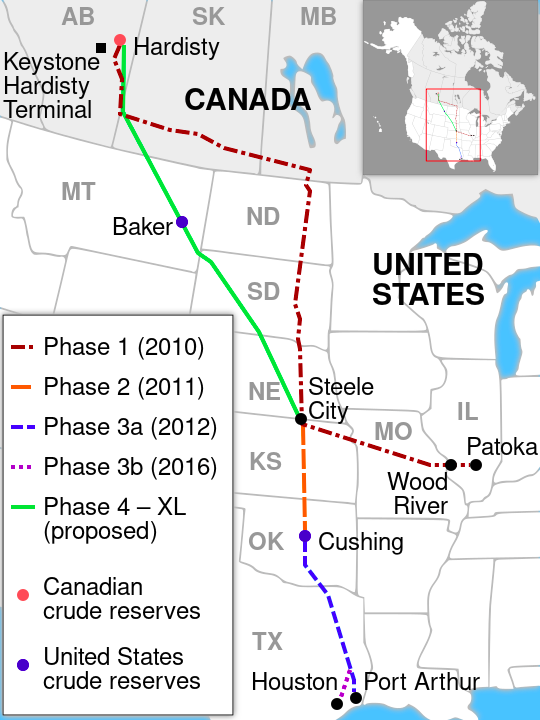
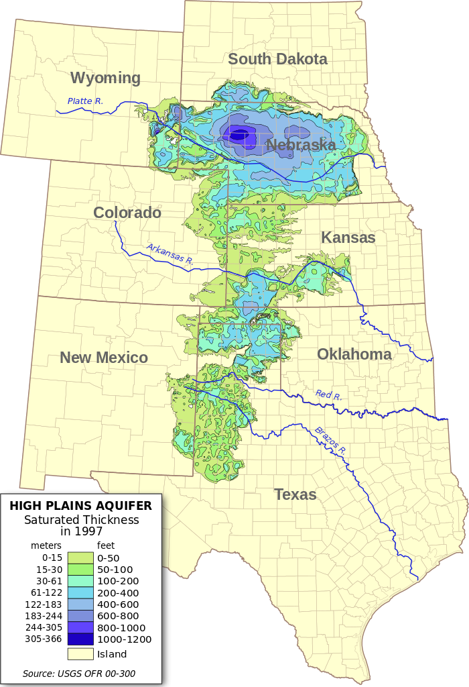
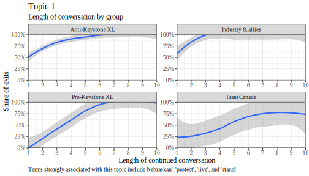
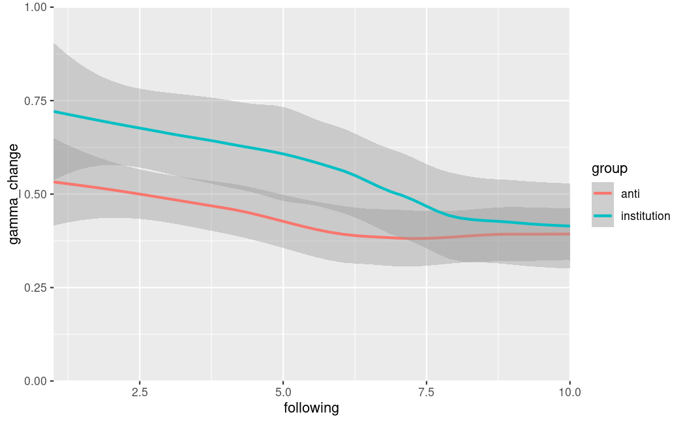

::: notes
* Thank Bodo
* Stage of the paper
  - Iteration of EGOS
  - Taking that feedback, and doing what we need to do for ASQ submission
  - Proto job talk
  - I am probably at a stage where I want to streamline 
* Very brief about myself, because it is relevant to the paper
  - Long time ago, at Free University Berlin where it is still 1968 and the Frankfurt School still rules supreme.
  - Lived in China, Peking University. American faculty, strong emphasis on everything quant.
  - Canada: more OT and micro-sociological approaches, like Jim March and Goffman
* Through what specific actions is the "institution" oil industry realized?
  - It is one thing to observe structurally that the growth of oil production and to conclude that the industry has governments in the bag.
  - It is another thing to show that in practical terms.
  - Fortunately, here I met Mark Zbaracki, who is even more cynical than me ever since he studied the sinking of the Ferry Estonia.
* 
:::

## Most recent

* Greenwashing in the Anthropocene: Net Zero by 2050
  - *Organization & Environment*
  - With Wren Montgomery (Ivey Business School) and Tom Lyon (Ross School of Business, University of Michigan)

::: notes
* Also SSHRC grant.
:::

---

* Please interrupt at any time (pretend it is not Zoom)

## Contents

* An example
* Theoretical models
* Background
* Mixed methods
  - Topic modeling
  - Axial coding
  
::: notes
* Chronologically, axial coding came first, but for the sake of this presentation I moved it to the back.
* The axial coding did more than the topic modeling did.
:::

# An example

::: notes
* To take you into the context and also explain what my work is about.
* You will see that the conversation is over before it has even really started.
* And yet, you cannot really place blame on anybody.
:::

## Over before it even started

* Four characters
  - Mark Welsch
  - Young Nebraskan peace activist
  - Early member of 350.org
  - Not an unusual Nebraskan--white, church-goer--other than political leaning
* Senator Brad Ashford
  - (Lawyer)
  - (Most of his life in Nebraska--Creighton University School of Law--Jesuit university, in Nebraska)
  - (Except for studies in Hamilton, New York)
* (Republican, later democrat)
  - (Elected by 7,000 vs. 5,000 votes, budget < $100,000)
  - Later member of US House of Representatives
  - (Chair of the Judiciary committee)
  - (Needs to make sure meeting finishes on time)
* Senator Ken Schilz
  - Farmer, bachelor degree from University of Nebraska Lincoln
  - Born 1969 in Oagallala (city of < 5,000), catholic
  - Vize Chairman of the Natural Resources Committee
* Senator Chris Langemeier
  - Also spent his life in small towns in Nebraska, catholic
  - Real estate broker
  - Republican, ran unopposed for reelection
 
::: notes
* Need to finish bullet points in brackets
* Before 350.org became a somewhat big deal. 
* Mark Welsch may not seem like important character, but that is why I chose him--not selecting on the outcome variable of making an impact, but looking at the average interaction.
 - You cannot observe an institution at work by looking at the moment it fails.'
* Ogallala--tourist attraction are five wooden buildings on a dirt road
:::

## Mark Welsch Example I--Dismissal

Mark Welsch: [...] I think it is very irresponsible [...] to think about spending a dime building electric transmission lines to service pumping stations that may not ever be built. If they are planned, the electric lines, and built, I hope that they will be built with the capacity to move power from all windfarms that will be built near those new power lines. Because we must stop global warming caused by burning fossil fuels, I believe this pipeline may become obsolete within 30 years. If we don't, the Pentagon has said they are concerned for our security in and out of this country due to global warming and the climate changes that it will cause. Some people think the third world war will be fought over water because of global warming and climate change. Thank you very much. 

Senator Ashford: Thanks, Mark. Questions of Mark? Seeing none, thank you. Next proponent. 

::: notes
* This is from the particularly rich dataset on the interactions in the Nebraska legislature, but this is all over the data. 
* Similar interactions with State Department, TransCanada
* Not rude, but the everybody says thank you all the time--so what does it really mean?
* You cannot nail anybody for doing anything specifically wrong--they are too smart to make procedural mistakes.
:::

## Mark Welsch Example II--Disregarding a topic

Mark Welsch: What happens if a governor is elected who believes the 98 percent of the global scientists in this country that global warming is caused by human activity, burning fossil fuels, and that governor just says no to every pipeline? Would that make all of you feel really good that you gave that much power to a future green governor? [...] In page 9, Section 8, it starts out with 30 days, but you never mention the Attorney General review. Is there not going to be an Attorney General review of this committee that is set forth? [...] And if somebody wanted to ask questions of an organization that does think that this Keystone pipeline should be stopped, not just rerouted, I'm your man.

Senator Ken Schilz: Thank you, Mr. Welsch. Any questions for Mr. Welsch? Senator Langemeier. 

Senator Chris Langemeier: Thank you, Senator Schilz. I do have one question for...and you brought up a whole new concept I hadn't thought of. Is there any AG review of the committee? Should there be an AG review of LB1, LB3, LB4, LB5 and LB6? 

::: notes
Meaning of the quote--you cannot choose what you talk about in a dialogue, you enter into existing conversations and you have to respond to others' actions.
:::

## Motivation

* Is there an indication that at some point we will stop expanding fossil fuel extraction?

::: notes
* Keystone XL--poster child for curtailing the oil and gas industry.
 - Celebrated as the biggest climate victory to date.
 - Does this victory indicate there may be more victories in the future?
* So we are testing discourse and activism under ideal conditions.
:::

# Literature on institutional processes

## Macro model

**New ideas are translated into institutional change**

1. Taken-for-grantedness of the institution [e.g., @Zucker1977]
  - Institution is stable
2. Problematization of the institution [@Maguire2009; @Suddaby2017]
  - An actor raises an issue
3. Translation [@Lawrence2017; @Hardy2020]
  - Other actors act on the problematization
  - Changes to practice
4. Institutional change or deinstitutionalization [@Harmon2015]

## Critiques

* Model does not sufficiently consider structural constraints [@Barley2008]
  - All steps of an institutional process are interactive
    + Including step 2 & 1
  - Institutional process occur in specific arenas with their own rules
    + These arenas usually favor institutional insiders
  - Institutions consist of organizational fields [see also @Barley2007]
    + Includes loosely coupled organizations that hold institutionalized understanding
* Discourse analysis cannot [@Leibel2018] 
  - (1) neglect agency expressed in framing and rhetorics
  - (2) neglect structural constraints put up by inhabitants of the institution

::: notes
* The two make related points, but in different context, @Leibel2018 is more focused on discourse.
* In particular, interactions should make an entrance already in step 2, meaning problematizations are structurally constrained.
* The last point challenges us to consider (1) who is a part of the institutional field"? (2) What do these inhabitants want and do?
:::

## Model II: Microfoundations of institutions

**Institutions are unlikely to be directly challenged**

* Stable institutions rest on implicitly held assumptions [@Harmon2019].
  - No explicit backing needed.
* When actors use a rhetoric that violates these assumption, this is *awkward* and leads to backlash [@Steele2021].
  - In my context, actors try to fit in and avoid this.
* Actors can also actively restore institutions [e.g., @Lok2013; @Harmon2019].
  - E.g., reaffirming, positive speech, negotiation, reflection and normalization.
* Most impactful are the earliest moments of change, when an institution is initially foregrounded [@Smets2012].
  - These moments are where the action is.
* Actors can strategically borrow from other institutional fields to make an argument [@McPherson2013; @Harmon2015].

**Summary**: The action may be where people are *not* talking!

::: notes
If the action is not where people are talking, it is where something is so taken for granted that it need not be talked about.
:::

## Puzzles

* How do we show institutional processes if people are not talking?

* How to avoid sampling on dependent variable: institutional outcomes?

::: notes
* These two are closely related--the second one is just saying, we want to see how an institution prevents assumptions from being foregrounded.
* Second: We do not want to select on dependent variable!
* Choose something that is not settled, where there is a controversy
  - Have to know what is going on in the discourse--you need the discourse's context, interactions, where there is not anything happening
  - Which can both be leading up to change or preventing change
:::

# Background

::: notes
* Question: can a random member of the audience tell me what she/he knows about Keystone XL?
:::

## Keystone XL pipeline

:::::::::::::: {.columns}
::: {.column}

:::
::: {.column}
**Proposed Keystone XL route**

* Direct route from Hardisty, Alberta to Steele City, Nebraska
* Transports oil sands diluted with natural gas condensate
  - Contains carcinogens such as benzene]
* Rallying point for climate movement
* Crossing Midwestern states
  - Low population density
  - In favor of Keystone
:::
::::::::::::::

## Keystone XL and Nebraska

:::::::::::::: {.columns}
::: {.column}

:::
::: {.column}
**Ogallala aquifer**

* Irrigation water for 30% of America
* Drinking water for 85% of Nebraska
:::
::::::::::::::

## Arenas & institutional field

* Demonstrate arenas and organizations (translate notebook drawing into illustration)

## Timeline--selected events

* 2010: Endogenous shock--two oil spills
* 2011-01-05: Protest at Nebraska State Capitol
* (Protests in Washington about climate change)
* (DOS, as other states issue permits, **debate in Nebraska continues**)
  - (Note that in Nebraska, no permit necessary)
* (2011-02-09: Nebraska considers legislation)
  - (Environmental movements & landowners)
* 2011-05-19: Nebraska Legislation fails
* 2011-02-10: State Department internal memo notes that additional studies on oil sand and climate impacts will be ready 'within weeks'.
* 2011-09-02: State Department issues releases Final Environmental Impact Statement for Keystone XL, announces hearings
* 2011-09: Nebraska governor experiences backlash over failure to reroute pipeline.
* 2011-11-07: Nebraska Governor opens special session on Keystone XL.
  - In response, **State Department puts Keystone XL permit decision on hold**
* 2011-11-14: TransCanada and State of Nebraska come to agreement to reroute pipeline
* (2012-04-18: Nebraska introduces legislation to honor Nov. 11 deal)
* 2012-05-23: Three Nebraska landowners file suit against new Nebraska Keystone XL permitting process. 
  - National reviewing process stalls
* 2014-04-18: **State Department officially pauses review process to wait for result of Nebraska lawsuit**.
* 2015-12-09: State Department denies Presidential Permit for Keystone XL.

::: notes
* Need to finish bullet points in brackets
* **Keystone XL lives on as "Zombie" pipeline, but far from taken for granted (obviously)**
* Divide timeline by stages? I.e., first challenge in Nebraska, second challenge in Nebraska, third challenge in Nebraska
* What matters is (are) the initial challenge(s) of substance that come out of the interactions in Nebraska
:::

## Mixed methods

* We create a timeline and inductively code the discourse
  - Nebraska repeatedly in the spotlight
* Inductive coding repeatedly inconsistent and unresolved
  - Universally declared intention to resolve environmental and social issues
    + Few actors except TransCanada directly object Keystone XL problematizations
  - Simultaneously often expressed or implicit support for pipeline
  - Actors effectively stalling the pipeline
  - Content of dialogue often tangential to the overarching discourse
* Conflict often around timelines and process not issues
* Both sides acknowledging that delay might kill pipeline

* **Bottom line**: lack of definitive actions *suggests* support for fossil fuel, but inductive coding of discourse contents insufficient 

::: notes
* In fact, there are some quotes that point to a key role of time in potentially bringing Keystone XL down.
* We zoom in on one arena. Each arena has its own rules that need to be understood.
:::

## The challenge: reflexivity

* Anything that is being said subsequently becomes part of the debate
* Example: 
  - 2010-10-28: Secretary of State suggests DOS "inclined" to approve Keystone XL
  - Comes under political pressure
* Actors avoid statements that open them up to criticism

**Bottom line**: State of Nebraska, TransCanada, State Department etc. are unwilling to change the status quo. But there are no definitive statements on the why and how.

## Example

Senator Carlson: I'm going to ask you some questions here, and I'm not leading you down a path. I think I'm going to illustrate maybe what your real concern is here. Are you against all the present oil pipelines in Nebraska? 

[Three more leading questions.]

Senator Carlson: Are you against coal-fired electrical generation?

Tim Taylor: No, not at all.

Senator Carlson: Are you--do you believe in global warming? (Laughter)

Tim Taylor: I'm--honestly, I'm not sure.

Senator Carlson: Okay.

Tim Taylor: I'm not trying to be cute or...I'm not sure.

Senator Carlson: I'm asking you these--I think your reservations and your resistance is for pure reasons. And I appreciate that. Thank you.

::: notes
* Should we code this as some sort of conspiracy in favor of Keystone XL?
* This is just one actor, but we do not have a sufficient density of these quotes to get a coverage on all actors.
* From this quote, we can draw some conclusions on the culture. But it does not allow us to conclusively characterize the institutional field and process.
* The statement of Secretary of State Clinton was even more vague, and deliberately so.
:::

# Topic modeling

::: notes
* Question: can a random member of the audience tell me what she/he knows about topic models so I know where to start?
* Chronologically, axial coding of the data came first, but I will show topic modeling stuff first for the sake of this presentation.
  - It is what we have been doing this past month in response to EGOS, toward ASQ submission. And the feedback was quite positive.
* We are going to do a statistical test with this next, for me its more important to understand what is going on first of all.
:::

## Data

* Zooming in on one arena--Nebraska Legislature
  - Representative of other arenas
  - Illustrates qualitative findings (next section)
* One year--8 public hearings of the Nebraska Legislature
  - Plus 8 public hearings to create more accurate topic model
  - Open hearings
    + Anybody can come
    + Five minutes to talk
    + The Senators as gate keepers who create discursive space by asking questions
* Topic model
  - Mathematically
    + Parsing the words in a discourse and determining which terms often co-occur
  - Choice of parameters
    + 29 topics that can be used to organize documents. (Statements always have multiple topics)
    + There are indicators for fit, but ultimately, need to vary parameter and inspect output
  - Inductive nature
    + We manually label the topics based on words and documents. (Not unlike traditional coding efforts.)

::: notes
* Gatekeeping function: that is why the initial quote is so important.
:::

## Example

(Grab exchange from Welsch. State topic numbers and labels for individual remarks in quote.)

## Approach

(What we do based on this structurally. We can tell who raises what issue. We know what group the actors belong to (e.g., anti-KXL environmental groups). We can observe the response. So we can observe exchanges as a sequence of interactions between the two/three sides and the Nebraska Senators. We can find pattern in invisible processes where things remain unspoken.)

## Finding I: dismissal

* Observe who is more likely to be ignored

::: notes
* ToDo: Use updated graph with sample size, add topic label
* Describe graph: we can see structurally what group is more likely to be ignored when raising a certain topic
* Instances where there is a clear statement on a topic (one standard deviation over mean, robust to two), what happens after?
* Walk readers through the graph
:::

## Finding I: dismissal

(Show two topics side by side and demonstrate that groups are more likely to get space when talking about certain issues)

## Finding II: disregarding a topic

(Show example of topics throughout one longer exchange, e.g., Cornell leader)

## Finding II: disregarding a topic

::: notes
* On this: still need to rule out alternative explanations, refine sampling approach
* But what we show here is who is industry more likely to be given more space to talk about topic, others less space
* Fits with our qualitative findings
  - Critics of Keystone XL are often not directly challenged on their viewpoints, but the topic changes maliciously
  - They need to explain their connections, funding, personal viewpoints etc.
:::

# Qualitative stuff

## Framing: The play between micro and macro

* Framing literature recognizes the often strategic nature of e.g., problematizations [@Snow1986; @Goffman1974].
* Literature primarily focuses on social movements and less on stable institutions' responses to external challenges [@Briscoe2016].
* Recent work emphasizes the dominating role of interactions in the production of frames [@Reinecke2021].
  - Empirical work on microfoundations of institutions suggests that many more processes exist than described so far. (Assuming that processes are often interactive.)

## Climate change--example of dismissal

:::::::::::::: {.columns}
::: {.column width="50%"}

**Climate change (forestalled)**\

*Sen. Carlson*: Are you--do you believe in global warming? (Laughter)

*Tim Taylor (landowner)*: I'm--honestly, I'm not sure. I'm not trying to be cute or...I'm not sure.

*Sen. Carlson*: I'm asking you these--I think your reservations and your resistance [against KXL] is for pure reasons. And I appreciate that. Thank you.

:::
::: {.column width="50%"}

**Eminent domain (disrupted)**\

*Sen. Adams*: With the number of constituents that I have that feel as though, right or wrong, that they have in effect been pushed to the edge and said, sign the easement agreement or we're going to court, all right, that is how eminent domain works. But you haven't been permitted yet. I struggle with that.

*Sen. Carlson*: Time.

:::
:::::::::::::

::: notes

\* Going in climate change, explaining how dismissal works, and showing that that also happens for eminent domain.

\* On the left--Nebraska Legislature floor debate. 

\* The Nebraska legislature has time limits for speaking during floor debates. If a senator runs out of time, then they are disrupted like on the left. Discourse stalled or prematurely ended etc.

\* Eminent domain was "kept alive" as an issue by a variety of actors who raised the issue again and again.

\* On the right--public hearings--rules more relaxed.

\* On the right, imagine how the conversation could have gone if Taylor had responded differently. We don't really have to imagine, because there are conversation with environmentalists. Also, imagine the effect of this exchange if you were the next person to testify, or testify later that day.

\* \*\*Just because somebody says something does not mean it will get heard!\*\* The senators can just move on to the next witnesses testimony and pretend the words were never uttered.

<!-- Need to explain the social component of dismissal.

1. Dismissal takes place before dialogue even begins.
2. In our context, many stakeholders are not even heard but skipped over--but it is difficult to demonstrate the *absence* of communication.
3. On the right here, Tim Taylor is *not* dismissed because he takes a position that Senator Carlson finds "pure". But their exchange signals to subsequent participants that climate change is not a welcome issue. -->

:::

## Pipeline spill risk--example of rules of the game

:::::::::::::: {.columns}
::: {.column width="50%"}

**Pipeline spill risk (informal rules, excerpt)**\

Sen. Haar: So, you know, the question will come up so I'll just ask it. Well, how does the fact that you're with NRDC color your testimony here today?

Anthony Swift: Well, my testimony has been fact based. [...]

Sen. Haar: So I get, you know, just extending that further, I mean, what...so what business do you have in Nebraska?

:::
::: {.column width="50%"}

**Eminent domain (informal roles)**\

(During Alan Peterson testimony on legal issues related to pipeline siting law)

Sen. Christensen: Okay. What is Sierra Club's stance on fossil fuels versus renewables?

Alan Peterson: I don’t know.

Audience: Oh, oh, oh. (Laughter)

Sen. Christensen: I'm done.

:::
:::::::::::::

::: notes

\# Just include one sentence of what Swift says.

\* On the left, excerpt of longer, 2,500 word "interrogation" Anthony Swift who came from Washington and was not warmly welcome. Lawyer at NRDC who had studied Kalamazoo River oil spill, one of the largest inland spills in US history, which involved oil sands like the one KXL would carry. 

\* Important--Swift lots of expertise, but did not get to talk about that--conversation was sidetracked by the legitimacy of his being there. Rather informal rule, but deprived him of opportunity to speak about subject matter. Trial and execution in one go, complete character assassination.

\* On the right--similar attack happened elsewhere, but Peterson managed to steer conversation back--Peterson is familiar to the senators for directing lawsuit in favor of nuclear waste dump against Nebraska! $150 million legal bill for Nebraska! So his (non)stance on renewables is credible--very contingent!

<!-- Need to explain function of rules of the game--it is dynamics and conversations that takes place *instead* of the discourse about the issue.

1. Changing the topic--not talking about or refusing to talk about the issue at hand. -->

:::

## Benzene in DilBit--information dearth

:::::::::::::: {.columns}
::: {.column width="50%"}

**On benzene in DilBit**

Sen. Haar: Now TransCanada really sort of pooh-poohed the idea of benzene, that benzene could enter groundwater. Is benzene a problem in groundwater or?

Dr. Woldt: Well, I don’t know what the constituents are in the fluid that TransCanada is talking about pumping, so I don’t know if benzene is in there if that would be a problem or not.

:::
::: {.column width="50%"}

**On eminent domain**

Sen. Haar: Since you're a landowner and the pipeline is slated to go through there, as I stated earlier, part of LB1 is that the Public Service Commission would take into account how landowners are treated. And when TransCanada said, "We also treat our 60,000 landowners with respect and fairness," how would you react to that?

Connie Weichman: Probably that we weren't treated fairly. But we have signed a nondisclosure statement, and so I don't really feel I can elaborate too much.

:::
:::::::::::::

::: notes

\* Information dearth--institutional insiders often control access to data!

\* I will do violence to these examples by shortening them a lot, more nuance and detail.

\* On the right: conversation with Dr. Woldt of UNL. UNL faculty were invited to testify and asked to collect information. Treated better than Corlell University staff from next slide. Woldt tried to collect more information, but could not access information on composition. Stalled for one year. 

\* "[W]e want to base our decisions on sound science so we have studies that are being done. But [...] they're always incomplete or there's always more to learn. And one of the drawbacks as I see it to maybe having that kind of philosophy is that we want sound science, and we want the university and other institutions to study things that are of interest to us... They'll study them forever for you."

\* TC countered by claiming that information is available.

\* On the right: TC consistently uses nondisclosure agreement. Also lie to landowners and "bully" them (their own words). Makes it difficult for landowners to compare and organize, know what's normal. In many instances, sign easements out of fear. Landowners cannot give detailed information bc NDA. Overcome because they are organized and provide piecemeal information, stitched together. Also, Landowners for Fairness has experience from Keystone. Very contingent!

:::

## Jobs claims--counter coalitions

:::::::::::::: {.columns}
::: {.column width="50%"}

**On jobs problematizations**

[W]e've had lengthy testimonies and contact and information provided to us by a number of the labor organizations in Nebraska that seem quite knowledgeable of what impact this pipeline is going to have on their union members in Nebraska. And I'm struggling here not...I mean, I welcome you to come and testify and I appreciate your testimony. But these are folks, these are jobs that are located in Nebraska that are talking about firsthand the impact this pipeline is going to have in Nebraska.

:::
::: {.column width="50%"}

**On eminent domain**

Sen. Haar: [C]ould we in any sense be held responsible for the easements that are purchased before the permit in your opinion? 

Alan Peterson: TransCanada has 1,800 lawyers or so, as near as I can tell. They'll present [their case] very well I'm sure.

:::
:::::::::::::

::: notes

\#\# Counter coalitions are the final hurdle--even with legitimate problematization, might not change official subject position because of social context

\* Lara Skinner, PhD U of Iowa, working at Cornell. School of Industrial and Labor Relations. Cornell wrote report on jobs claims. Explaining why KXL 2,500 jobs, 50 permanent. Not 20,000 or even 120,000. Also, risk for aquifer which supplies agriculture--15% of Nebraska economy.

\* TC PLA for KXL with unions--union managers advertising KXL. Locally embedded. Lara Skinner coming from outside and facing suspicion of being "socialist". Data is not king, the coalition is.

\* On the right: Peterson convinces senators that they can take legislative action, but senators still hesitant, bc. TC would fight back. Even if you are right, you still have to convince the court, and resources are important for legal battles. TC sending two high-profile lawyers from NE to session. Peterson also respected, but senators decide to play it safe, make compromise with TC. Ironically, few months later compromise provides opening for anti-KXL coalition. Again, very contingent.

:::

## This is the last slide before the Q&A

**Epilogue**:

* Uneventful climax
    - Four-year court battle over Keystone XL by three embittered landowners 
* Twist on the identified mechanisms
    - Frustrated landowners commit to "judicial trench warfare"
    - No willingness to compromise after not being heard

Thank you!

::: notes

\* The whole series of events is contingent, but this is the most profoundly contingent.

\* Last very contingent element in a series of contingent events

:::

## References

# Appendix

## Problematization--definition

------------
*Texts that "substantiate and dramatize the ineffectiveness and injustice of existing practices" [@Colomy1998 via @Maguire2009].*

------------

## Translation--definition

--------------
*"[T]he spread in time and space of anything--claims, orders, artefacts, goods--\[...\] in the hands of people; each of these people may act in many different ways, letting the token drop, or modifying it, or deflecting it, or betraying it, or adding to it, or appropriating it" [@Latour1984].*

--------------
