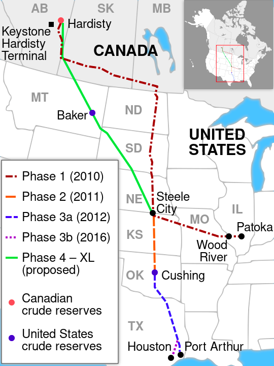
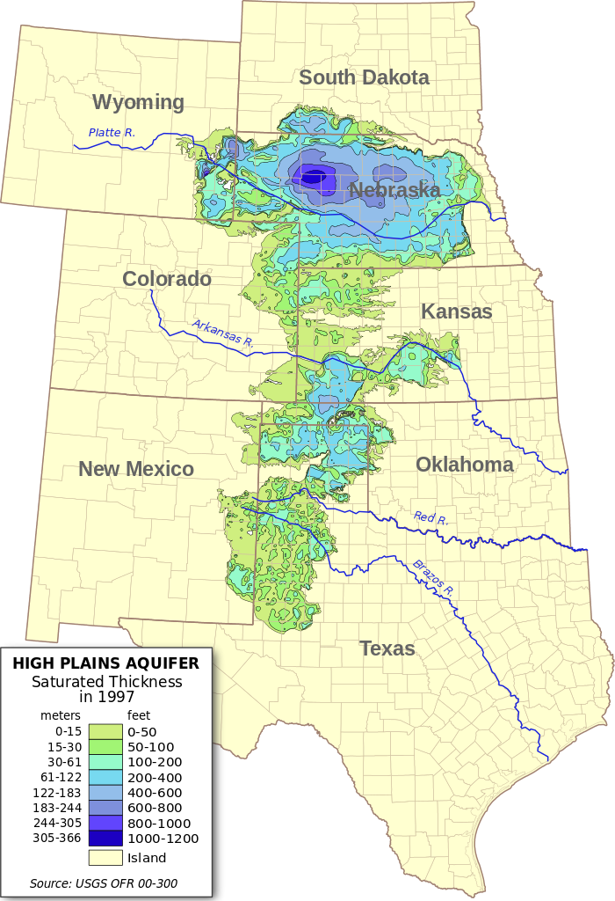
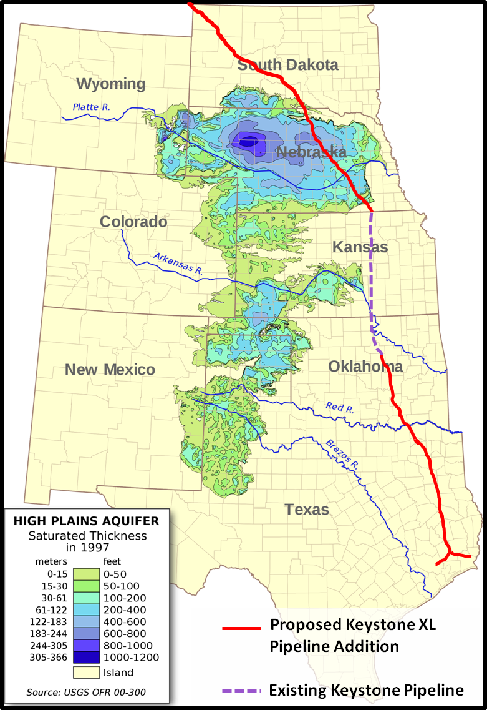
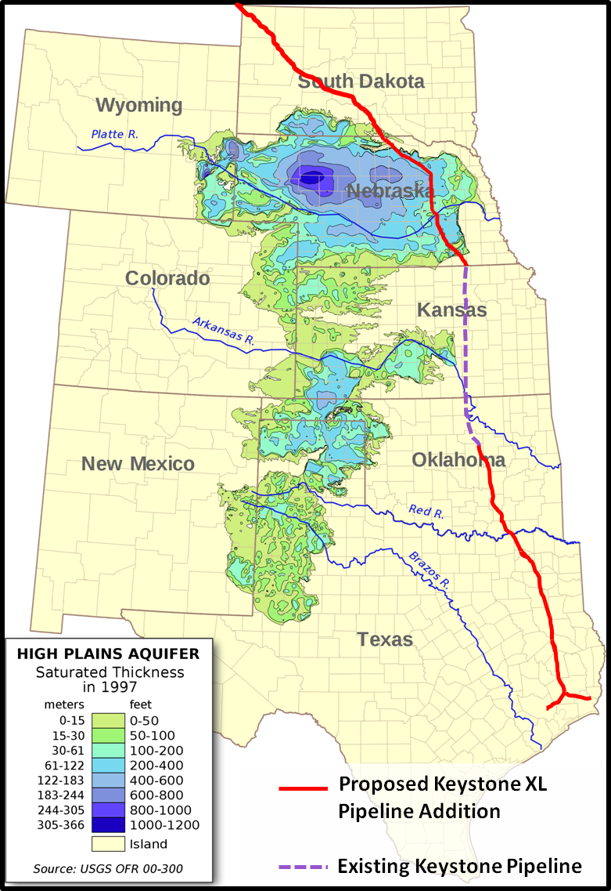
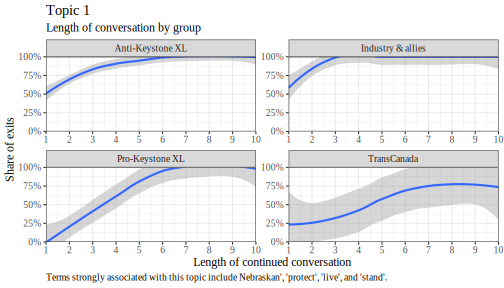
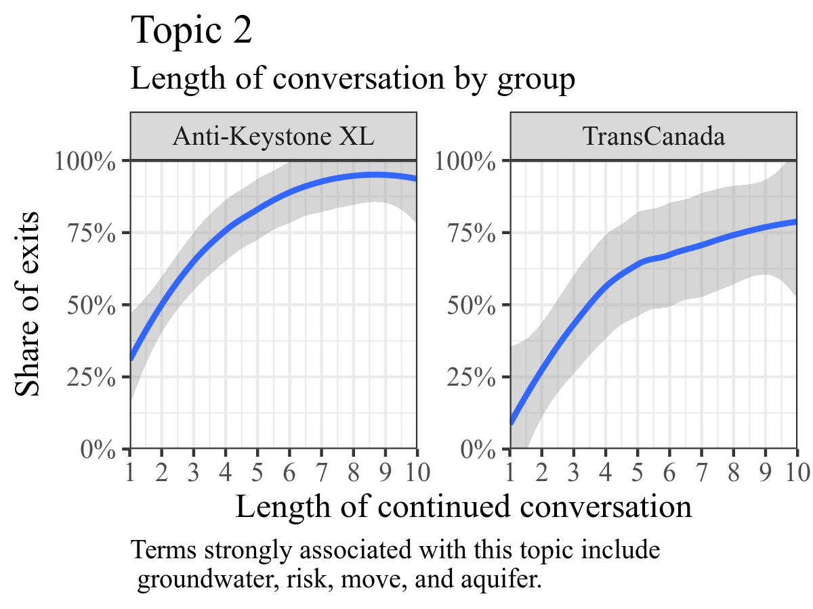
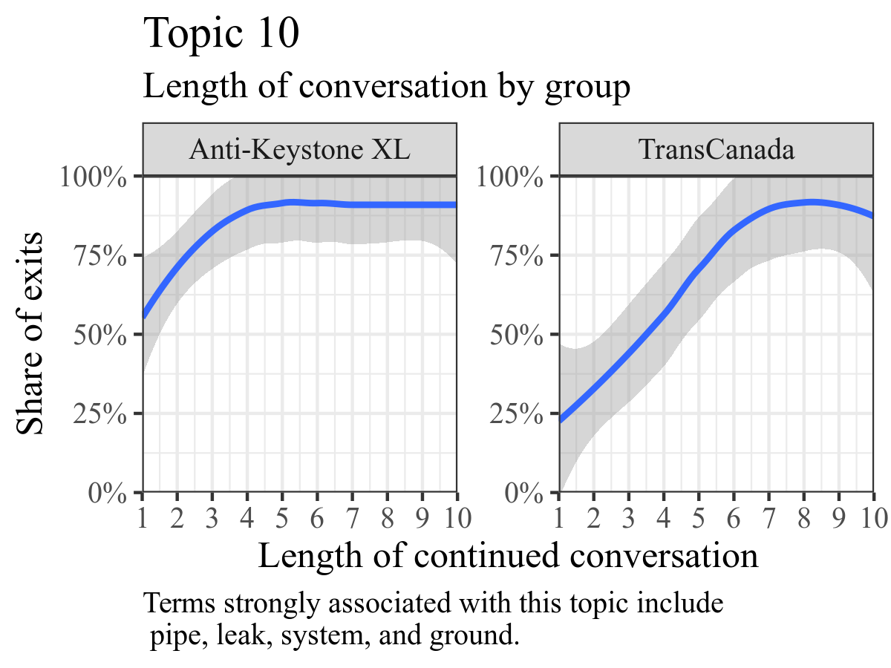

::: notes
Start by stating that I am in control of the conversation and that I can ask anybody anything. How fabulous! And then ask Lee whether he thinks everybody should be doing research on climate change.
:::

---

> Senator Carlson: Are you against additional pipelines in Nebraska?
> 
> Tim Taylor: No, sir.
> 
> Senator Carlson: Are you against the further development of fossil fuels?
> 
> Tim Taylor: No, not at all, sir.
> 
> [...]
> 
> Senator Carlson: Are you against coal-fired electrical generation?
> 
> Tim Taylor: No, not at all.
> 
> Senator Carlson: Are you--do you believe in global warming? (Laughter)
> 
> Tim Taylor: I'm--honestly, I'm not sure.

::: notes
I am not just randomly asking that. That is pretty close to the actual conversation from the data. Guess how that would have impacted the subsequent conversation. Turns out that what group you are with has an enormous impact on what you can and cannot say.
:::

## Motivation

* Is there an indication that at some point we will stop expanding fossil fuel extraction?

::: notes
Here I could add that I selected Keystone XL for my study because it is the poster child for curtailing the oil and gas industry.
:::

# Two models of institutional processes

## Model I: Macro model of discourse and institutions

**New ideas are translated into institutional change**

1. Taken-for-grantedness of the institution [e.g., @Zucker1977]
        + Institution is stable
2. Problematization of the institution [@Maguire2009; @Suddaby2017]
        + An actor raises an issue
3. Translation [@Lawrence2017; @Hardy2020]
        + Other actors act on the problematization
        + Changes to practice
4. Institutional change or deinstitutionalization [@Harmon2015]

## Critiques

* @Barley2008
* @Leibel2018
* Discourse viewed in the context of inhabited institutional fields

::: notes
There is people and all sorts of politics involved here. Focusing on the "official" timeline in the discourse is insufficient. There are also permanent structures that affect all this.
:::

## Model II: Microfoundations of institutions

**Institutions are unlikely to be directly challenged**

* Stable institutions rest on implicitly held assumptions [@Harmon2019].
    + No explicit backing needed.
* When actors use a rhetoric that violates these assumption, this is *awkward* and leads to backlash [@Steele2021].
    + In my context, actors try to fit in and avoid this.
* Actors can restore an institution in a variety of ways [e.g., @Lok2013; @Harmon2019].
    + E.g., reaffirming, positive speech, negotiation, reflection and normalization.
* Most impactful are the earliest moments of change, when an institution is initially foregrounded [@Smets2012].
    + These moments are where the action is.
* Actors can strategically borrow from other institutional fields to make an argument [@McPherson2013; @Harmon2015].

**Summary**: The action may be where people are *not* talking!

::: notes
Need to include @Barley2008 somewhere here.
:::

## Puzzle

How do we show institutional processes if people are not talking?

# Context

## Keystone XL

* Pipeline from Alberta to Gulf of Mexico
    - Follow-up to successful Keystone pipeline
    - Transporting oil sand for world market
    - Rallying point for climate movement 
* Initially scheduled for completion in 2011
    - Delayed from 2011-2015 in Nebraska
    - Finally defeated in 2015
    - Celebrated as turning point for climate movement
* Zombie project
    - Revived in 2017
    - Killed again in 2021
    - Dead for good? Continued conversation

# Methods

::: notes
Let me move you through some of the things we did.
:::

---

:::::::::::::: {.columns}
::: {.column}

:::
::: {.column}
**Proposed Keystone XL route**

* Direct route from Hardisty, Alberta to Steele City, Nebraska
* Transports oil sands diluted with natural gas condensate
  - Contains carcinogens such as benzene
* Crossing Midwestern states
  - Low population density
  - In favor of Keystone
:::
::::::::::::::

::: notes
We mapped out the timeline.
:::

## Macro discourse
:::::::::::::: {.columns}
::: {.column}

:::
::: {.column}
**Ogallala aquifer**

* Irrigation water for 30% of America
* Drinking water for 85% of Nebraska
:::
::::::::::::::

::: notes
* Environmentalists problematize Keystone XL route
* Nebraska Legislature, State department, and TransCanada take on the problematization
* TransCanada sizes the initiative and determines alternative route. 
    + *Note*: Other actors support TransCanada's initiative.
:::

## Macro discourse

* :heavy_check_mark: Taken-for-grantedness
    - 2008-2010: Original Keystone pipeline completely smoothly.
    - **2010-04-04: DOS finds Keystone XL environmental impacts "limited".**
    - 2010-10-28: Secretary of State suggests DOS "inclined" to approve Keystone XL.
* :heavy_check_mark: Problematization
    - 2010-05-20: Deepwater Horison 210 million US gallons of oil into Gulf of Mexico.
        * Largest marine oil spill
    - 2010-07-27: Enbridge Line 6B spills up to 1 million US gallons of diluted oil sands into Kalamazoo River.
        * Worst US inland oil spill
    - 2011-01-05: Protest staged outside Nebraska Legislature to prevent Keystone XL route over Ogallala aquifer.
* :heavy_check_mark: Translation
    - 2011-03-15: State Department announces Supplemental Environmental Impact Statement, extends permitting process scope and timeline.
    - 2011-10-23: Nebraska governor calls special session of the state legislature on Keystone XL.
    - 2011-11-14: TransCanada agrees to change route of Keystone XL around Ogallala Aquifer.
* :heavy_check_mark: Institutional change
    - 2011-11-08: State Department initiates Special Review of KXL permitting process to verify compliance with laws and regulations.
    - 2011-11-10: **State Department announces review of the Keystone XL pipeline route, delaying permit decision until 2013.** 
    - 2011-11-14: **TransCanada announces decision to reroute Keystone XL pipeline and protect the Ogallala Aquifer.**

::: notes
This slide is too long. Should be broken up into 4? And I am not sure if it should be in this spot.
:::

## Macro discourse

:::::::::::::: {.columns}
::: {.column}

:::
::: {.column}

:::
::::::::::::::

::: notes
I do not have the right words for this. But this is very interesting. We see translation in action. And how the result can diverge from our expectations. Because the translation process is one where other actors become involved. In this case, TransCanada took the initiative. *Of course* they would choose a minor revision like this.
:::

---

::: notes
That is the official version of the story that permeates the approval process. But that is not all. So what is going on?
:::

## Microfoundations: Stalling

* *Climate change*--a glancing blow 
    - State Department rapidly integrates issue to enhance legitimacy of permitting process.
* *Ogallala Aquifer*--a minor blow
    - Environmental groups identify new angle that resonates with Nebraskans. 
    - Keystone XL quickly regains legitimacy through minor changes.
    - *Note*: conversation has shifted from "phase out fossil fuel" to "protect the Sandhills".
* *Property rights/Nebraska constitution*--critical blow
    - Landowners identify angle for lawsuit based on constitutional/procedural issues.
    - Leads into negative permit decision.
    - *Note*: environmental talking points now completely removed from discourse in Nebraska.

**Bottom line**: critical development is the initial shift of the conversation into a territory where the institution is vulnerable.

## Microfoundations: Stalling

* *Climate change discours*
    + 2010: Environmental organizations challenge Keystone XL on climate impact grounds in letters to Secretary of State, Congress, State Department.
    + 2011-02-10: State Department internal memo notes that additional studies on oil sand and climate impacts will be ready 'within weeks'.
    + 2011-03-15: In responds to public pressure, State Department announces additional 45 day comment period on Keystone XL. TransCanada 'pleased' regulatory process is moving forward.
* *Ogallala Aquifer discours*
    + 2011-01-05: Protest at Nebraska State Capitol features 'united front' of environmental groups and farmers' union.
        * Aquifer, farming, and soil among issues covered.
    + 2011-02-09: Farmers' concerns about water and property rights resonate with lawmakers at Nebraska Legislature public hearing.
    + 2011-09-02: State Department issues releases Final Environmental Impact Statement for Keystone XL, announces that if approved Keystone XL would begin operating in 2013.
    + 2011-09: Nebraska governor experiences backlash over failure to reroute pipeline.
    + 2011-11-07: Governor opens special session of Nebraska Legislature to reroute pipeline.
    + 2011-11-10: State Department puts Keystone XL permit decision on hold until at least 2013 to identify new route.
    + 2012-05-04: TransCanada submits new permit application for alternative route.
* *Property rights/Nebraska constitution discours*
    + 2012-04-18: Nebraska introduces new permitting process for Keystone XL.
    + 2012-05-23: Three Nebraska landowners file suit against new Nebraska Keystone XL permitting process. 
        * The plaintiffs receive material support from environmental grassroots.
    + 2014-04-18: State Department pauses review process to wait for result of Nebraska lawsuit.
    + 2015-09-30: TransCanada yields to Nebraska lawsuit and resubmits application to other Nebraska agency.
    + 2015-12-09: State Department denies Presidential Permit for Keystone XL.

::: notes
At the micro level, we can see that the discourse is being absorbed by the institution, up until 2015.
:::

## Recap

Translation model

* Captures how social interaction changes discourse
* Does not capture early moments that set the course

Microfoundations

* Great at capturing critical moments
* Theorizes why institutions are stable, not how they fail
* Literature is largely built around stable, uncontentious institutions, very unlike the Keystone XL discourse.\

**Bottom line**: This is incomplete--there is both a pattern of new issues/variations being raised, and being shut down.

::: notes
**Todo**: This is probably incomplete, following our discussion. What I want to point out is that there is a pattern to both problematizations being raised, *and* to them being shut down. That is what I want to study. (Or at least the second part is, the first part is what the framing literature points out.) In Mark's words--there is a method behind this. Need to weave that in here.
:::

## Step III: Topic modeling

> John Pollack: I can tell you that in my...among my personal documents, I have a report by the National Academy of Sciences that was released in the late 1970s entitled "Understanding Climatic Change." So even back then among scientists they weren't referring to it so much as global warming. I would call that a popularized term which gets an idea across succinctly, but it's an incomplete term.
> 
> Senator Carlson: Okay. Thank you.
> 
> Senator Langemeier: Seeing no other questions, thank you very much. Appreciate your testimony. Further testimony as proponents. Good afternoon.

::: notes
* Identifying the topic of the remark by John Pollack is trivial. Note that we could do the same coding by hand. 
* Note how the conversation abruptly ends. If we can identify more examples like this, we could find a pattern.
:::

## Step III: Topic modeling

**How to identify meaningful silence**\

* Observe when a topic is raised by different groups
* How long does this conversation continue?
* What groups are ignored?
* Who is allowed to propagate their opinion?
* Who is politely shut down?
    - *Note*: In Nebraska, *everybody always* says thank you!
    
**Bottom line**: Who is allowed to talk about what?

::: notes
Could give a rundown or ask for questions.
:::

## Example I: length of conversation

::: notes
* What do we see here: 50% of the anti-Keystone XL individuals are shut down immediately when raising the topic. 
    - For pro-Keystone XL individuals, the rate is 0%. 
* I added a confidence interval so you get an idea of how many people we are talking about. For anti-Keystone XL, it is a lot of people. I did not add the mean though, so that should hover around the blue line.
* 50% of pro-Keystone XL individuals have some form of conversation, with back-and-forth 3-4 times.
    - Less than 20% of and-Keystone XL individuals do.
* Bias--be prepared to be ignored.
:::

## Example II: Who can talk about what?

:::::::::::::: {.columns}
::: {.column}

:::
::: {.column}

:::
::::::::::::::

::: notes
* Clearly, institutional insiders are allowed to talk about pipeline spill risks, but protesters are shut down when they discuss the topic. 
* Pipeline safety is federal, so Nebraska regulations in this area would be preempted.
* Senators police the crowd accordingly.
* Now interestingly, there is one anti-KXL person on the right there who can have a long conversation on the topic.
:::

## Step III: Topic modeling

> Anthony Swift: [...] But as I said, when you're dealing with natural gas pipelines, you've got another agency, the Federal Energy Regulatory agency, that does provide protection over the routing of pipelines. With hazardous liquid pipelines, it's only left to the state to do that. If the states don't do it, you know, companies like TransCanada can dictate terms.
> 
> Senator McCoy: [T]hank you for your testimony, Mr. Swift. I understand were you based out of Washington, D.C., when you talk about your federal background?
> 
> Anthony Swift: Yes, yes.
> 
> Senator McCoy: And how did you come to be here today? Were you asked
to be here?

::: notes
Note how abruptly the topic changes. We are able to detect that. I don't have that in these slides though.
:::

## Framing: The play between micro and macro

* Framing literature recognizes the often strategic nature of e.g., problematizations [@Snow1986; @Goffman1974].
* Literature primarily focuses on social movements and less on stable institutions' responses to external challenges [@Briscoe2016].
* Recent work emphasizes the dominating role of interactions in the production of frames [@Reinecke2021].
    - Empirical work on microfoundations of institutions suggests that many more processes exist than described so far. (Assuming that processes are often interactive.)

## Step IV: Qualitative perspective

Went into the transcripts to see the interactions and understand patterns.

::: notes
Need something to call this. Need to craft a compelling slide. Although all it needs to say is--I will show you what I found next.
:::

## Climate change--example of dismissal

:::::::::::::: {.columns}
::: {.column width="50%"}

**Climate change (forestalled)**\

*Sen. Carlson*: Are you--do you believe in global warming? (Laughter)

*Tim Taylor (landowner)*: I'm--honestly, I'm not sure. I'm not trying to be cute or...I'm not sure.

*Sen. Carlson*: I'm asking you these--I think your reservations and your resistance [against KXL] is for pure reasons. And I appreciate that. Thank you.

:::
::: {.column width="50%"}

**Eminent domain (disrupted)**\

*Sen. Adams*: With the number of constituents that I have that feel as though, right or wrong, that they have in effect been pushed to the edge and said, sign the easement agreement or we're going to court, all right, that is how eminent domain works. But you haven't been permitted yet. I struggle with that.

*Sen. Carlson*: Time.

:::
:::::::::::::

::: notes

\* Going in climate change, explaining how dismissal works, and showing that that also happens for eminent domain.

\* On the left--Nebraska Legislature floor debate. 

\* The Nebraska legislature has time limits for speaking during floor debates. If a senator runs out of time, then they are disrupted like on the left. Discourse stalled or prematurely ended etc.

\* Eminent domain was "kept alive" as an issue by a variety of actors who raised the issue again and again.

\* On the right--public hearings--rules more relaxed.

\* On the right, imagine how the conversation could have gone if Taylor had responded differently. We don't really have to imagine, because there are conversation with environmentalists. Also, imagine the effect of this exchange if you were the next person to testify, or testify later that day.

\* \*\*Just because somebody says something does not mean it will get heard!\*\* The senators can just move on to the next witnesses testimony and pretend the words were never uttered.

<!-- Need to explain the social component of dismissal.

1. Dismissal takes place before dialogue even begins.
2. In our context, many stakeholders are not even heard but skipped over--but it is difficult to demonstrate the *absence* of communication.
3. On the right here, Tim Taylor is *not* dismissed because he takes a position that Senator Carlson finds "pure". But their exchange signals to subsequent participants that climate change is not a welcome issue. -->

:::

## Pipeline spill risk--example of rules of the game

:::::::::::::: {.columns}
::: {.column width="50%"}

**Pipeline spill risk (informal rules, excerpt)**\

Sen. Haar: So, you know, the question will come up so I'll just ask it. Well, how does the fact that you're with NRDC color your testimony here today?

Anthony Swift: Well, my testimony has been fact based. [...]

Sen. Haar: So I get, you know, just extending that further, I mean, what...so what business do you have in Nebraska?

:::
::: {.column width="50%"}

**Eminent domain (informal roles)**\

(During Alan Peterson testimony on legal issues related to pipeline siting law)

Sen. Christensen: Okay. What is Sierra Club's stance on fossil fuels versus renewables?

Alan Peterson: I don’t know.

Audience: Oh, oh, oh. (Laughter)

Sen. Christensen: I'm done.

:::
:::::::::::::

::: notes

\# Just include one sentence of what Swift says.

\* On the left, excerpt of longer, 2,500 word "interrogation" Anthony Swift who came from Washington and was not warmly welcome. Lawyer at NRDC who had studied Kalamazoo River oil spill, one of the largest inland spills in US history, which involved oil sands like the one KXL would carry. 

\* Important--Swift lots of expertise, but did not get to talk about that--conversation was sidetracked by the legitimacy of his being there. Rather informal rule, but deprived him of opportunity to speak about subject matter. Trial and execution in one go, complete character assassination.

\* On the right--similar attack happened elsewhere, but Peterson managed to steer conversation back--Peterson is familiar to the senators for directing lawsuit in favor of nuclear waste dump against Nebraska! $150 million legal bill for Nebraska! So his (non)stance on renewables is credible--very contingent!

<!-- Need to explain function of rules of the game--it is dynamics and conversations that takes place *instead* of the discourse about the issue.

1. Changing the topic--not talking about or refusing to talk about the issue at hand. -->

:::

## Benzene in DilBit--information dearth

:::::::::::::: {.columns}
::: {.column width="50%"}

**On benzene in DilBit**

Sen. Haar: Now TransCanada really sort of pooh-poohed the idea of benzene, that benzene could enter groundwater. Is benzene a problem in groundwater or?

Dr. Woldt: Well, I don’t know what the constituents are in the fluid that TransCanada is talking about pumping, so I don’t know if benzene is in there if that would be a problem or not.

:::
::: {.column width="50%"}

**On eminent domain**

Sen. Haar: Since you're a landowner and the pipeline is slated to go through there, as I stated earlier, part of LB1 is that the Public Service Commission would take into account how landowners are treated. And when TransCanada said, "We also treat our 60,000 landowners with respect and fairness," how would you react to that?

Connie Weichman: Probably that we weren't treated fairly. But we have signed a nondisclosure statement, and so I don't really feel I can elaborate too much.

:::
:::::::::::::

::: notes

\* Information dearth--institutional insiders often control access to data!

\* I will do violence to these examples by shortening them a lot, more nuance and detail.

\* On the right: conversation with Dr. Woldt of UNL. UNL faculty were invited to testify and asked to collect information. Treated better than Corlell University staff from next slide. Woldt tried to collect more information, but could not access information on composition. Stalled for one year. 

\* "[W]e want to base our decisions on sound science so we have studies that are being done. But [...] they're always incomplete or there's always more to learn. And one of the drawbacks as I see it to maybe having that kind of philosophy is that we want sound science, and we want the university and other institutions to study things that are of interest to us... They'll study them forever for you."

\* TC countered by claiming that information is available.

\* On the right: TC consistently uses nondisclosure agreement. Also lie to landowners and "bully" them (their own words). Makes it difficult for landowners to compare and organize, know what's normal. In many instances, sign easements out of fear. Landowners cannot give detailed information bc NDA. Overcome because they are organized and provide piecemeal information, stitched together. Also, Landowners for Fairness has experience from Keystone. Very contingent!

:::

## Jobs claims--counter coalitions

:::::::::::::: {.columns}
::: {.column width="50%"}

**On jobs problematizations**

[W]e've had lengthy testimonies and contact and information provided to us by a number of the labor organizations in Nebraska that seem quite knowledgeable of what impact this pipeline is going to have on their union members in Nebraska. And I'm struggling here not...I mean, I welcome you to come and testify and I appreciate your testimony. But these are folks, these are jobs that are located in Nebraska that are talking about firsthand the impact this pipeline is going to have in Nebraska.

:::
::: {.column width="50%"}

**On eminent domain**

Sen. Haar: [C]ould we in any sense be held responsible for the easements that are purchased before the permit in your opinion? 

Alan Peterson: TransCanada has 1,800 lawyers or so, as near as I can tell. They'll present [their case] very well I'm sure.

:::
:::::::::::::

::: notes

\#\# Counter coalitions are the final hurdle--even with legitimate problematization, might not change official subject position because of social context

\* Lara Skinner, PhD U of Iowa, working at Cornell. School of Industrial and Labor Relations. Cornell wrote report on jobs claims. Explaining why KXL 2,500 jobs, 50 permanent. Not 20,000 or even 120,000. Also, risk for aquifer which supplies agriculture--15% of Nebraska economy.

\* TC PLA for KXL with unions--union managers advertising KXL. Locally embedded. Lara Skinner coming from outside and facing suspicion of being "socialist". Data is not king, the coalition is.

\* On the right: Peterson convinces senators that they can take legislative action, but senators still hesitant, bc. TC would fight back. Even if you are right, you still have to convince the court, and resources are important for legal battles. TC sending two high-profile lawyers from NE to session. Peterson also respected, but senators decide to play it safe, make compromise with TC. Ironically, few months later compromise provides opening for anti-KXL coalition. Again, very contingent.

:::

## This is the last slide before the Q&A

**Epilogue**:

* Uneventful climax
    - Four-year court battle over Keystone XL by three embittered landowners 
* Twist on the identified mechanisms
    - Frustrated landowners commit to "judicial trench warfare"
    - No willingness to compromise after not being heard

Thank you!

::: notes

\* The whole series of events is contingent, but this is the most profoundly contingent.

\* Last very contingent element in a series of contingent events

:::

## References

<!-- ## Research question

* Why was Keystone XL at different points in time defeated or victorious?
* What is the character of the discourse on Keystone XL?
* What is the general character of the climate discourse? (Or discourse between organizations more widely?)

::: notes
The first question will probably require me to provide a basic overview over the development of Keystone XL first.
::: -->

<!-- ## Methods

* Mixed methods study of Keystone XL
  - Inductive analysis
  - Natural language processing, topic modeling
* Benefits of the context:
  - Convoluted history--allows repeated observation of processes
  - Clear benchmark for outcome--is the pipeline approved/built?
  - Good data access
    + Discourse mostly public
    + Background documents made public through Freedom of Information Act requests
  - Relevant for multiple debates:
    + Climate change/impacts
    + Polarized public discourse
    + Post-truth/misinformation
 -->

<!-- ## There is a series of critiques of the institution

* A macro argument is insufficient
* This is a good starting point -->
